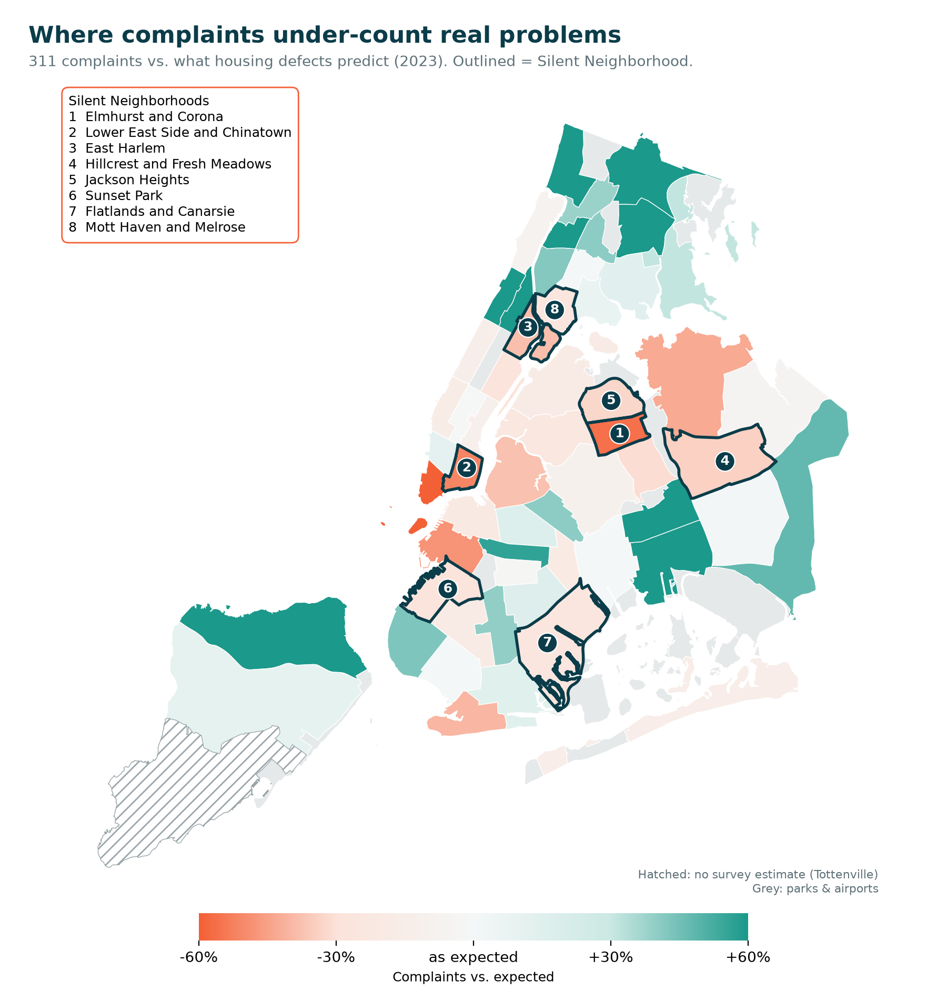
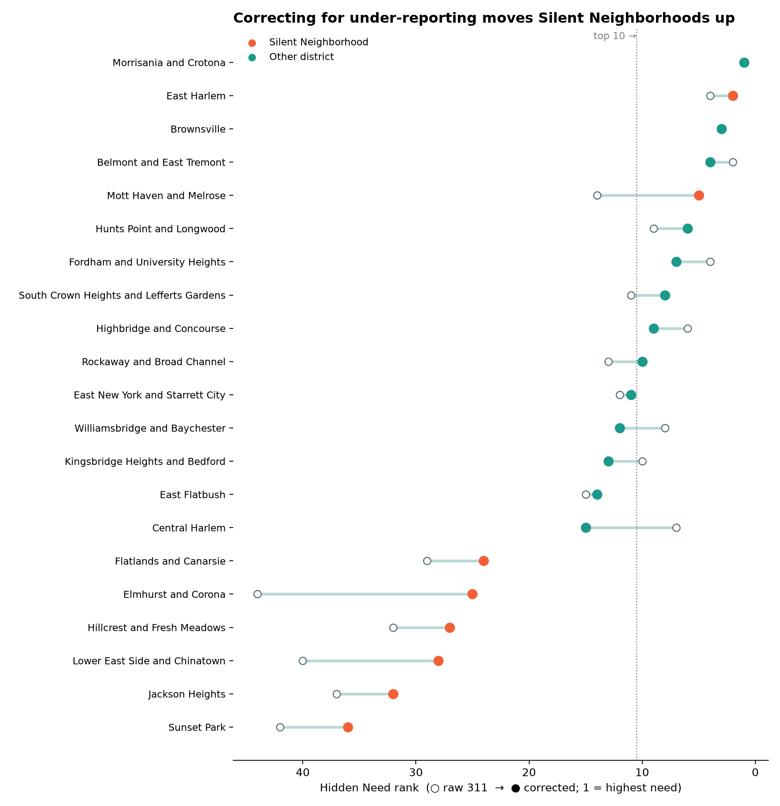
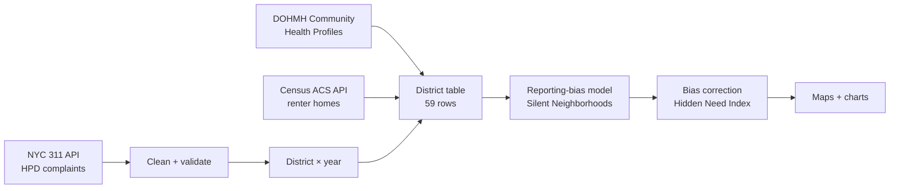

# Hidden Need Index

**Correcting 311 reporting bias to find NYC neighborhoods with hidden housing and mental health need.**

311 complaints are fast but biased: they only capture people who know how to call and feel able to. Health surveys are fair but slow. This project uses DOHMH's survey data to measure how much each neighborhood under-reports housing problems to 311, then corrects the live 311 signal so that high-need neighborhoods aren't overlooked because they complain less.



---

## Key findings

**1. 311 tracks real housing conditions, which makes the exceptions meaningful.**
Survey-reported housing defects explain about 59% of the variation in complaint rates across districts (R² = 0.59, p < 0.001). Each extra percentage point of renter homes with defects brings about 3.8% more complaints.

**2. Eight "Silent Neighborhoods" complain far less than their housing problems predict.**
These districts have above-median defects but at least 20% fewer complaints than expected:

| District | Complaints vs. expected |
|---|---|
| Elmhurst & Corona | −56% |
| Lower East Side & Chinatown | −51% |
| East Harlem | −38% |
| Hillcrest & Fresh Meadows | −34% |
| Jackson Heights | −33% |
| Sunset Park | −28% |
| Flatlands & Canarsie | −26% |
| Mott Haven & Melrose | −25% |

**3. Limited English is associated with under-reporting (exploratory).**
Holding poverty and foreign-born share constant, districts one standard deviation higher in limited-English residents report about 20% less than their defects predict (p = 0.014). Poverty goes the other way (+18%, p = 0.013), which masks the language effect in a simple correlation. The model explains a modest share of variation (R² = 0.14), so this is a lead to validate, not a conclusion.

**4. Correcting for under-reporting changes who looks highest-need.**
After correction, **Mott Haven & Melrose moves from #14 to #5** on the Hidden Need Index. Three districts enter the top 10 only after correction, and Elmhurst & Corona climbs 19 places (#44 → #25).



---

## How it works



| Step | Script | What it does |
|---|---|---|
| 1. Ingest | `fetch_311.py` | Pulls 311 HPD housing complaints (2021–present) month by month, with server-side aggregation, retries, and checkpointing |
| 2. Clean | `clean_311.py` | Maps 311 labels to community district codes, merges complaint-type format variants, runs 7 quality checks |
| 3a. Reshape | `summarize_311.py` | District × year table; flags partial years so they are never compared with full years |
| 3b. Renters | `fetch_acs_renters.py` | Renter-occupied homes from the Census ACS 2019–2023 by PUMA |
| 3c. Integrate | `build_district_table.py` | Joins DOHMH, 311, and Census data; complaint rates per 1,000 renter homes |
| 4. Bias model | `reporting_bias.py` | Expected complaints from defects (log-linear OLS); reporting ratio = actual ÷ expected; flags Silent Neighborhoods; tests who under-reports |
| 5. Index | `hidden_need_index.py` | Corrects 2025 complaints by each district's reporting ratio; combines with psychiatric hospitalizations (z-scores, equal weight) |
| 6. Maps | `make_maps.py` | Choropleth maps of reporting bias and the Hidden Need Index |

### Method in brief

- **Why renter homes?** HPD complaints come from renters. Dividing by all residents made homeowner neighborhoods look artificially quiet.
- **Expected complaints:** `log(complaints per 1,000 renter homes) = a + b × (% homes with defects)`, fit across 58 districts using 2023 data (the survey year).
- **Reporting ratio:** actual ÷ expected. 1.0 means a district complains as much as its conditions predict.
- **Silent Neighborhood:** defects at or above the city median **and** reporting ratio below 0.8. High need is required, so a quiet low-need district is not called silent.
- **Correction:** `corrected rate = 2025 complaint rate ÷ reporting ratio`. This scales under-reporting districts up and over-reporting districts down.
- **Hidden Need Index:** average of the z-scores of the corrected housing rate (log scale) and psychiatric hospitalizations per 100,000 adults.

---

## Data quality

- **4.05 million** HPD complaints (Jan 2021 – Sep 2026); **99.9%** mapped to one of NYC's 59 community districts.
- Every excluded complaint is counted by reason (unspecified location, parks/airports, unparseable), and totals reconcile.
- The duplicate check caught that 311 began recording some complaint types in two formats (e.g. `APPLIANCE` and `Appliance`). These are merged after standardizing, while true duplicates still fail the check.
- DOHMH-suppressed estimates (`^`) are kept as missing, never zero; "interpret with caution" estimates (`*`) are flagged.
- **49 automated tests** (pytest), including tests that feed in deliberately broken data to prove each quality check catches it, and tests that plant a known "silent" district in synthetic data to confirm the model finds it.

---

## Limitations

- **Correlation, not causation.** Findings describe neighborhoods, not individuals (ecological fallacy).
- **Small sample.** 58–59 districts, and some share estimates (e.g. 101 & 102), so statistical results are exploratory.
- **Survey uncertainty.** The Housing and Vacancy Survey has margins of error; five districts are marked "interpret with caution" and Tottenville (503) is suppressed and excluded from the bias model.
- **Stable reporting assumption.** 2023 reporting ratios are applied to 2025 complaints.
- **Renter estimates.** Four Census PUMAs cover two districts each; their renter homes are split by population.
- **Psychiatric hospitalizations measure service use, not only need.** The same barriers that suppress 311 calls may also suppress hospital use, which would under-state need in the Silent Neighborhoods.
- **Equal weights** in the index are a transparent default, not a policy judgment.

## Next steps

- Validate reporting ratios against the next Housing and Vacancy Survey release.
- Test whether the mental health measure shows the same bias, e.g. against survey-reported psychological distress.
- Run the pipeline on a schedule (e.g. monthly) and move storage to the cloud (S3 + Athena).
- Add mental health service locations to find where need outpaces available care.

---

## Run it yourself

**Setup**
```bash
git clone https://github.com/SaloniChitre/nyc-hidden-need-index.git
cd nyc-hidden-need-index
python3 -m venv .venv
source .venv/bin/activate
python -m pip install -r requirements.txt
```

**Two manual steps**
1. **DOHMH Community Health Profiles:** download the 2026 Public Use Dataset (Excel) **in a browser** from the [Community Health Profiles page](https://www.nyc.gov/site/doh/data/data-publications/profiles.page) and save it as `data/raw/2026-chp-pud.xlsx`. (nyc.gov blocks scripted downloads.)
2. **Census API key:** get a free key at <https://api.census.gov/data/key_signup.html>, activate it from the email, then:
   ```bash
   export CENSUS_API_KEY="your_key"
   ```

**Pipeline** (run in order from the project root)
```bash
python src/fetch_311.py            # ~10–20 min on first run; resumes if interrupted
python src/clean_311.py
python src/summarize_311.py
python src/fetch_acs_renters.py
python src/build_district_table.py
python src/reporting_bias.py
python src/hidden_need_index.py
python src/make_maps.py
python -m pytest -v
```

Outputs land in `data/clean/` (tables, as Parquet and CSV) and `outputs/` (charts, maps, JSON summaries). Raw and clean data are not committed; the pipeline rebuilds them.

## Project structure

```
nyc-hidden-need-index/
├── src/                 pipeline scripts (one per step)
├── tests/               pytest tests
├── outputs/             charts, maps, summaries
├── data/                raw/ and clean/ (git-ignored, rebuilt by the pipeline)
├── DATA_CATALOG.md      every data source, its year, geography and limitations
├── requirements.txt
└── pytest.ini
```

See [`DATA_CATALOG.md`](DATA_CATALOG.md) for source details.

---

**Author:** Saloni Chitre · MS Data Science, Pace University · [LinkedIn](https://www.linkedin.com/in/saloni-chitre) · [GitHub](https://www.github.com/SaloniChitre)